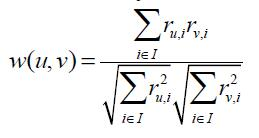
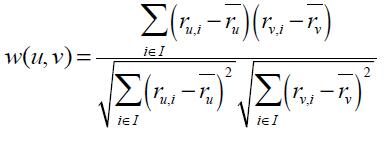
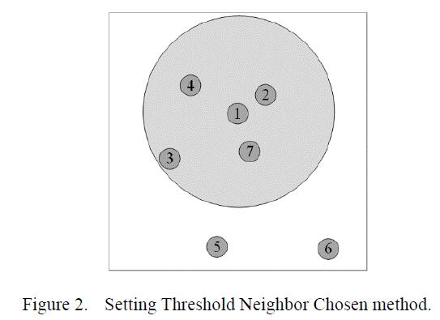

#A Survey of Collaborative Filtering Algorithms for Social Recommender Systems

>Two kinds of main collaborative filtering

- **user-based collaborative filtering**
- **item-based collaborative filtering**

##*user-based collaborative filtering*
基于用户的协同过滤的思想是，比较不同用户的相似性程度，利用相似用户的评分物品进行推荐。
###**计算评分矩阵**

用户i对物品的平均评分：

因此，用户i对物品j的预测打分，可以表示为：

其中，w(i,k)表示用户i与用户k的相似度，下式为正则化因子

计算用户间的相似度的方法有很多，可以用余弦相似度、Pearson系数等。

1.余弦相似度定义为：

其中$r_{ui}$表示用户u对物品i的打分。改进的方法是，减去物品的均值，如下：

2.Pearson系数定义为：

###**发现邻近用户**

1.方法一：KNN

聚类，发现top3个邻近用户，如图：

2.方法二：阈值法

设置阈值，若相似度大于阈值，则属于邻居；不断降低阈值，直到找到k个邻居，如下：

##*item-based collaborative filtering*
基于物品的协同过滤的思想是，比较不同物品的相似性程度，根据当前对已有物品的打分推荐相似的物品。
###**计算评分矩阵**
用户i对物品j的打分预测：

w(k,j)是物品的相似度，可以利用上文的余弦相似度计算。

##*协同过滤的挑战*
###**冷启动**

冷启动问题是所有推荐系统都会遇到的问题之一，主要包括了新用户和新物品的冷启动。

###**高计算量**

推荐系统在时间复杂度和空间复杂度都具有较高的要求，因此应该适当处理好在线计算和离线计算两部分。

###**稀疏问题**

推荐系统中，每一个用户对海量物品中极少数物品产生评分记录，因此得到的评分矩阵是极其稀疏的。
