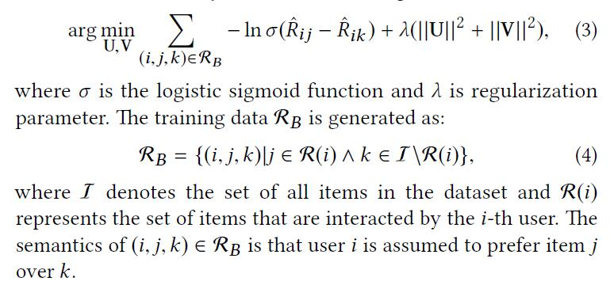
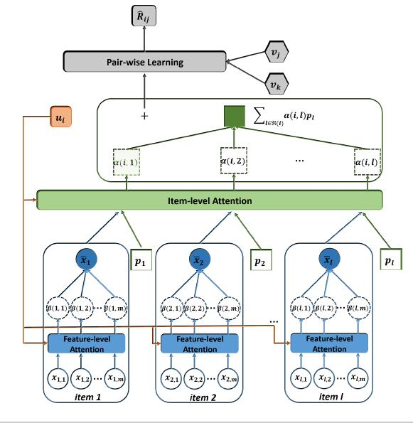
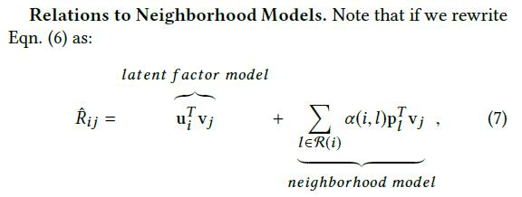

# Attentive Collaborative Filtering: Multimedia Recommendation with Item- and Component-Level Attention

> attention-based CF

## PRELIMINARIES
### Latent Factor Models

缺点：applying SVD in implicit feedback domain raises
difficulties due to the high portion of unobservable data.
### Bayesian Personalized Ranking (BPR)

## ATTENTIVE COLLABORATIVE FILTERING
### General Framework

目标函数（从BPR借鉴）：

评分预测：

模型的解释（与Neighborhood Models关系）：

因为the weights should be highly dependent to the user and the item content，因此作者设计了一个动态计算用户相关的权值计算方法。

### Item-Level Attention
权值的计算，利用一个两层网络：

### Component-Level Attention
权值的计算，同样是一个两层网络：

