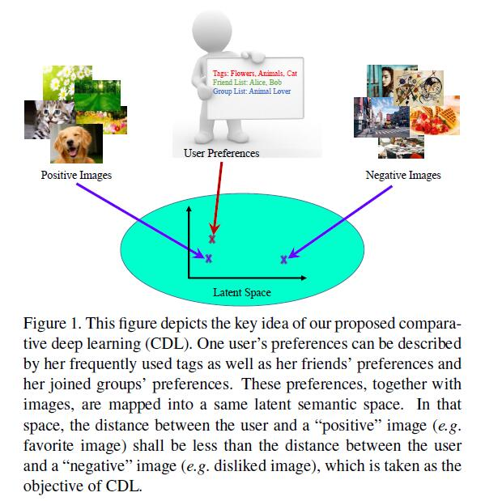
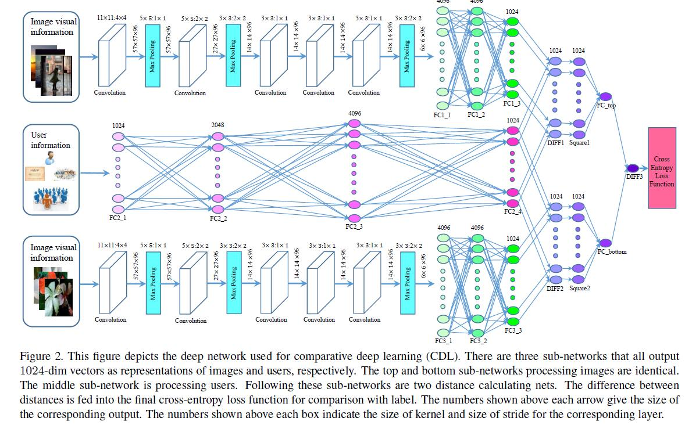
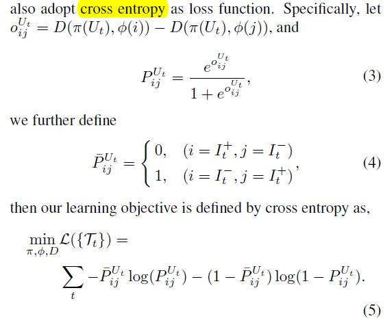
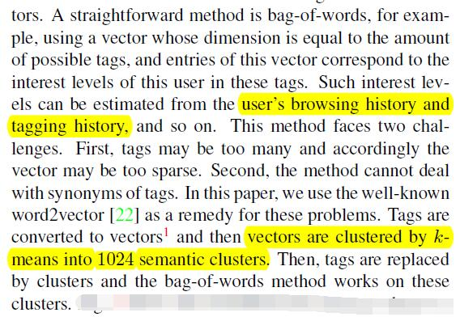
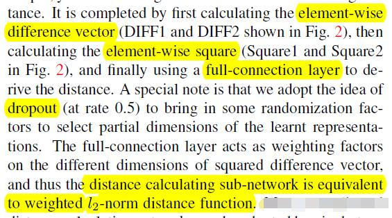
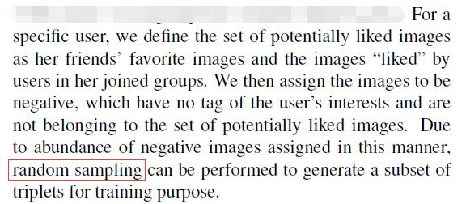

# Comparative Deep Learning of Hybrid Representations for Image Recommendations

[论文原文](https://github.com/chenboability/RecommenderSystem-Paper/blob/master/Deep%20Learning/paper/Comparative%20Deep%20Learning%20of%20Hybrid%20Representations%20for%20Image%20Recommendations..pdf)

> 图片推荐，利用CNN神经网络将图片和用户映射到同一个隐式空间中，如图所示

## 框架

## 问题

输入为3元组，利用两个映射函数，将物品和图片映射到同一个空间中，然后利用一个距离函数进行比较

损失函数为交叉熵

因此，问题主要为学习两个映射函数和一个距离计算函数。

## Comparative Deep Learning (CDL)

图片的映射函数通过一个CNN学习，用户的映射函数通过一个全连接神经网络学习。因此，构造了3个神经网络，然后对3个神经网络的输出结果，在构造了2个距离计算网络。

### 图片映射

### 用户映射

直接使用词袋模型存在两方面困难：

- 标签太多
- 同义词

解决方法：

先进行次向量化，然后用k-means距离，缩小标签空间到1024个，再用词袋模型

### 距离计算

## 负样本

先利用社交网络的数据作为候选负样本，再进行随机采用

