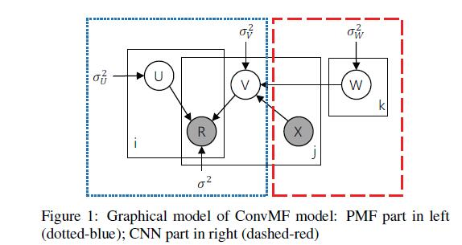
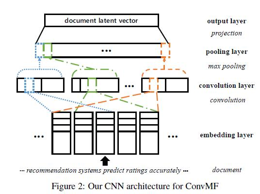
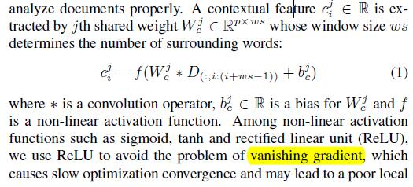
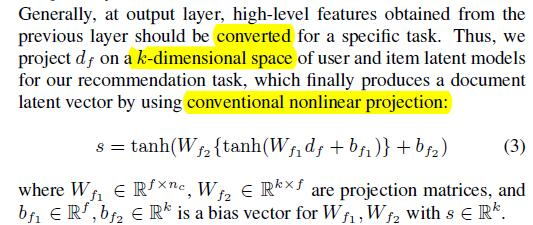

# Convolutional Matrix Factorization for Document Context-Aware Recommendation

[论文原文](https://github.com/chenboability/RecommenderSystem-Paper/blob/master/Deep%20Learning/paper/Convolutional%20matrix%20factorization%20for%20document%20context-aware%20recommendation.pdf)

## 框架

整体的图模型（PMF+CNN）

其中的CNN框架：

## CONVOLUTIONAL MATRIX FACTORIZATION

### Probabilistic Model of ConvMF

U部分就是普通的PMF模型，而V部分则：

### CNN Architecture of ConvMF

思路与DeepCoNN一致，主要包含4个层，1) embedding layer,
2) convolution layer, 3) pooling layer, and 4) output layer：

第一层，embedding layer

对一个l个词组成的文档，构成一个矩阵：

第二层，Convolution Layer

目的是提取语义特征，利用滑动窗口，对词向量做卷积，提取多个特征；同时，选取多个不同的权值W，获得在多个不同权值下的特征（与DeepCoNN一致）

第三层，pooling layer

为应对不同长度的矩阵，同时消除一些没有帮助的冗余特征，采用max pooling，最终为每一个权值，求得一个最大特征。

第四层，output layer

将特征映射到k维空间中

