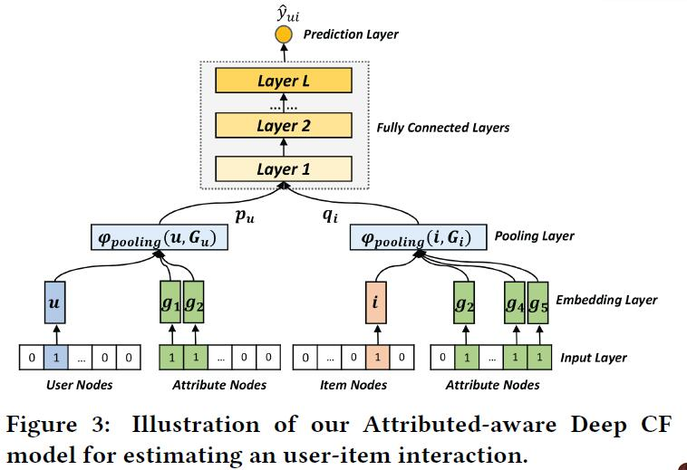
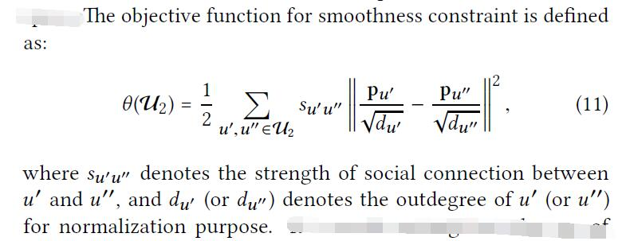
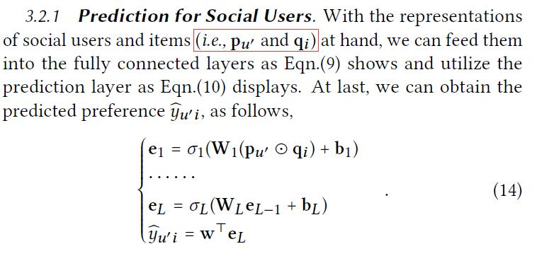

# Item Silk Road Recommending Items from Information Domains to Social Users

[论文原文]()

## Learning of Information Domain

对CF的参数估计，选择的目标函数的pairwise loss函数，具体为the regression-based loss：

Attribute-aware Deep CF Model：

与NCF的不同之一在于，加入了一个Pooling Layer，因为不同用户、不同物品提取出来的属性向量的大小不一致，而pooling可以将其规约到一个固定大小的向量。

隐层（全连接层）和预测层与NCF类似。

## Learning of Social Domain

利用graph regularization(aka.semi-supervised learning on graph)知识来对社交网络用户进行预测，特别是将bridge users传播到non-bridge-users.

**Smoothness constraint** implies the structural consistency — the nearby vertices of a graph should not vary much in their representations.

**Fitting constraint** implies the latent space consistency across two domains — the bridge users’ representations should be invariant and act as the anchors across domains.

两个不同域的同一个表达方式，应该足够近，因此定义的目标函数为：

最终，对两个约束条件进行结合：

预测，类似于上面的Information Domain，也是多层的神经网络表示方法：

两个域的融合：

