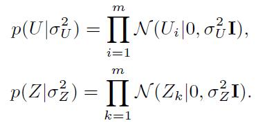
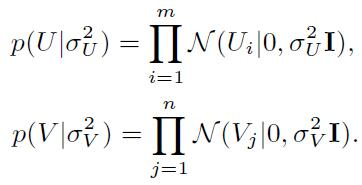
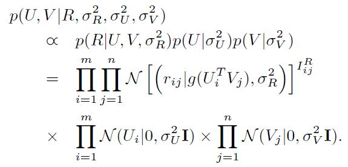
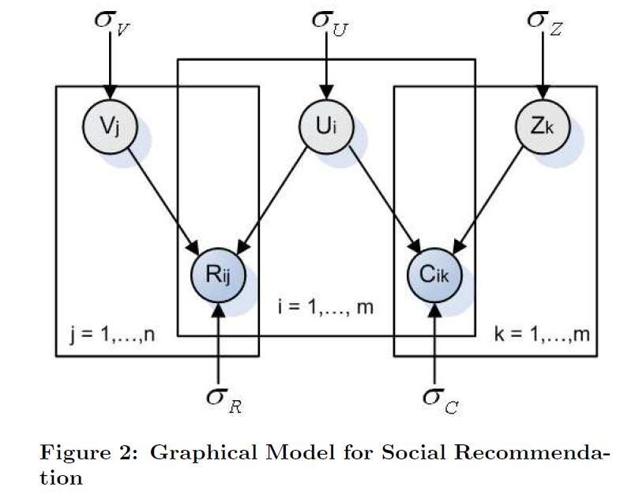
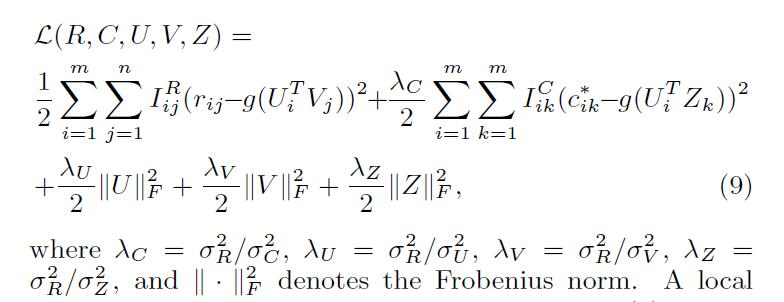

# SoRec: Social Recommendation Using Probabilistic Matrix Factorization

[论文原文](https://github.com/chenboability/RecommenderSystem-Paper/blob/master/Matrix%20Factorization/paper/Social%20Recommendation%20Using%20Probabilistic%20Matrix%20Factorization.pdf)

> 文章思路：结合社交关系和MF，预测用户评分；利用社交关系，为新用户提供参考，解决冷启动问题。

社交图的示例如下图a所示（有向图），边的权值表示用户的信任程度，该图可以用m*m矩阵形式表示。原始的用户打分矩阵如b所示（用户4是新用户），预测的打分矩阵如c所示：

## Social Network Matrix Factorization

社交网络的条件分布：

user and factor feature vectors上的0均值的spherical Gaussian priors：

贝叶斯推理：

一般是用户显式指定的。由于社交网络图中不同用户信任值的标准不一样，如出边很多的节点信任值应该适当降低；入边很多的节点信任值应该适当身高。所以，上式可以改成：

## User-Item Matrix Factorization

同理如下：

## Matrix Factorization for Social Recommendation

图模型：

log后的后验分布如下：

最大化上式，即最小化平方和误差（sum-of-squared-errors），如下：

可以通过梯度下降，求得局部最小值。

