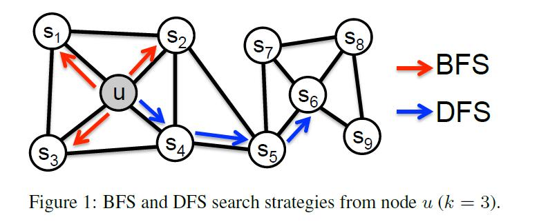
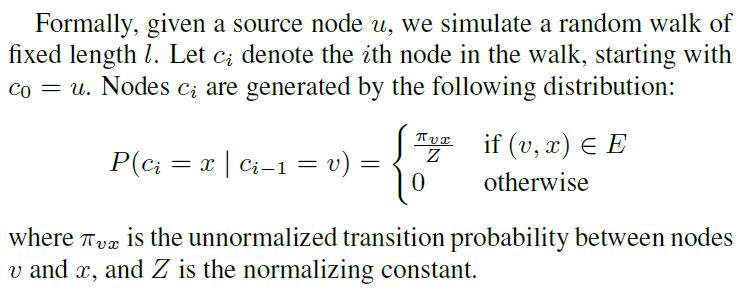
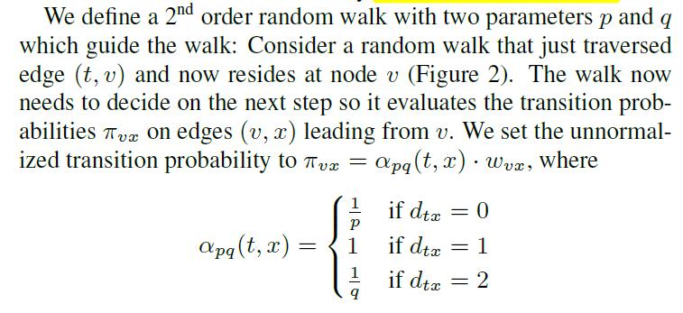

# node2vec: Scalable Feature Learning for Networks

[论文原文](https://github.com/chenboability/RecommenderSystem-Paper/blob/master/Top%20N%20Problem/paper/node2vec%20Scalable%20Feature%20Learning%20for%20Networks.pdf)

## 最大化似然的优化问题

可以将特征学习问题看成是最大化似然的优化问题，目标函数如下：

对目标函数进行优化，基于以下两个观察：

因此，目标函数可以优化为：

## 寻找邻居

### 传统的方法

bfs和dfs都不能同时满足两类相似度：homophily and structural
equivalence。

- homophily hypothesis nodes that are highly interconnected and belong to similar network clusters
or communities should be embedded closely together (e.g.,
nodes s1 and u in Figure 1 belong to the same network community).

- structural equivalence hypothesis nodes that have similar structural roles in networks should be embedded
closely together (e.g., nodes u and s6 in Figure 1 act as
hubs of their corresponding communities).

因此，利用bfs和dfs来建立一种寻找邻居的方法，可以满足这两种评估。

### 随机游走

因此，通过调节Return parameter, p和In-out parameter, q，可以在上述两种相似度中权衡，寻找合适的邻居节点。

